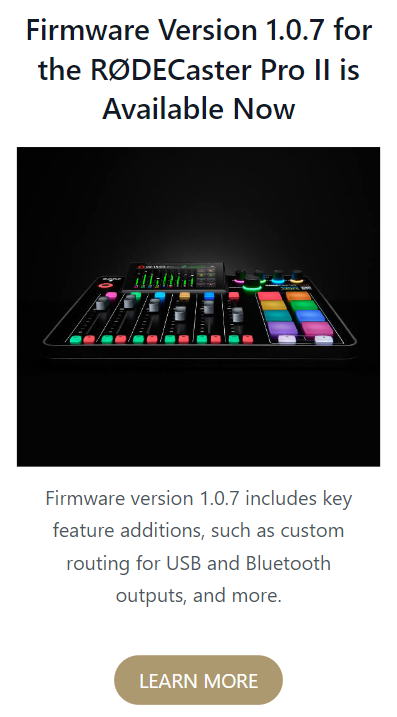
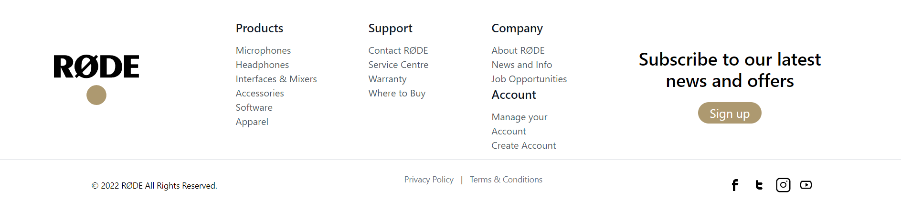

# RodeClone_Tailwind
created a clone of Rode using, 
- Tailwind-CSS

### Mobile Screens
- Section_A

- Section_B

- Section_C

- Section_D

- Section_E

- Section_F

- Section_G

- Section_H

- Section_I

### lg:Laptop / Desktop Screens
- Section_A

- Section_B

- Section_C

- Section_D

- Section_E

- Section_F

- Section_G
